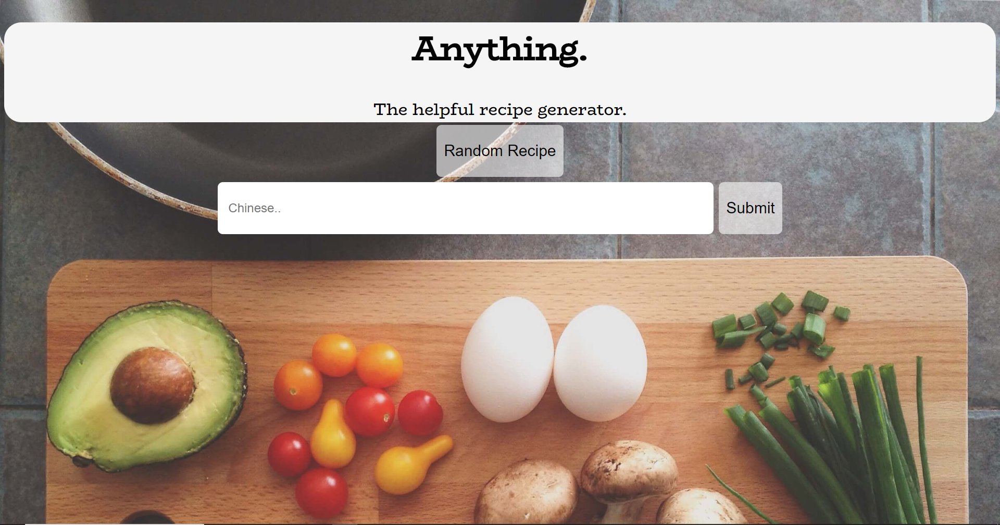
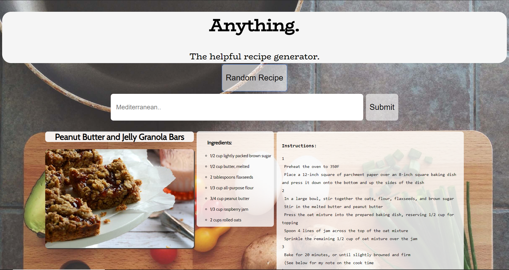

# AnythingAPI
Anything. The helpful recipe generator. 
Using Spoonaculars recipe API, I've built a simple random recipe generator using HTML5, CSS, JavaScript, and jquery. 

https://cbonner26118.github.io/AnythingAPI/

This is designed for people who have a hard time deciding on a meal for any occasion, and if you are craving something a little more particular, you can input a type of cuisine into the search bar and it will bring you a random recipe of that style.

